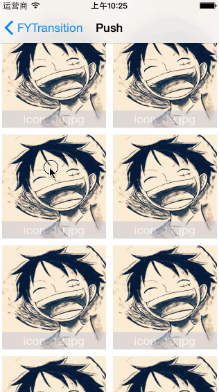
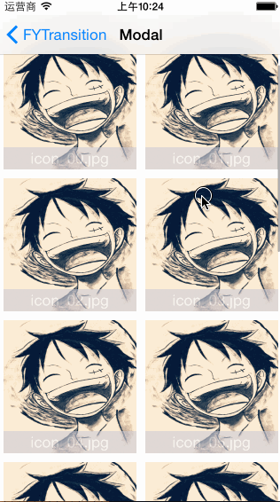

   

框架说明 DESC
===============
>.本框架可以快速集成图片过渡转场动画,目前有push和modal两种方式,呈现方式为zoom放大动画效果.  

效果图展示
===============

##### push方式
   

##### modal方式
   

一.简单上手(使用默认方式)
===============

1.在.h文件中继承父类
--------------------------
    /**
     *  使用默认的方式,导入头文件 FYTransitionController.h
     *  创建一个继承自 FYTransitionController 的子类控制器即可
     */
    @interface ImageViewController : FYTransitionController 

    @property (weak, nonatomic) IBOutlet UILabel *titleLabel;

    @end

2.push或者modal出控制器
--------------------------

    UIImageView *oImageView = [[UIImageView alloc] initWithImage:cell.imageView.image];
    oImageView.frame =[cell.imageView convertRect:cell.imageView.frame toView:self.view];
    ImageViewController *imageVC = [[ImageViewController alloc] initWithOriginalImageView:oImageView];
    imageVC.transitioningDelegate = imageVC;
    imageVC.view.backgroundColor = [UIColor darkGrayColor];
    [self presentViewController:imageVC animated:YES completion:^{
        imageVC.titleLabel.text = cell.label.text;
    }];

   

二.自定义图片(图片在下一个控制器的位置)的位置
===================================

1.在.h文件中继承父类并遵守协议
--------------------------
    /**
     *  导入头文件 FYTransitionController.h
     *  创建一个继承自 FYTransitionController 的子类控制器,并且遵守 FYTransitionProtocol 协议
     */
    @interface CustomViewController : FYTransitionController <FYTransitionProtocol>

    @end

2.在.m文件中实现协议方法
--------------------------
    /**
     *   返回imageView的位置,需要特别注意的是,如果使用xib布局的话,不能直接返回控件的frame,
     * 因为控件还未初始化,所以在这里得用代码设置imageView的位置
     *
     *  @return 返回imageView在其父控件的frame
     */
    - (CGRect)fy_transitionFinalImageViewFrame{
        return  CGRectMake(10, 65, 300, 300);
    }

    /**
     *   动画完成后的回调,获得最终imageView,在此回调中将imageView添加到父控件中,
     * 在下面的方法中没有添加 imageView 的相关代码是因为使用了xib,直接赋值就好了
     *
     *  @param imageView 回调传值
     */
    - (void)fy_transitionCompleteAnimateImageView:(UIImageView *)imageView{
        self.mainImageView.image = imageView.image;
        self.mainImageView.backgroundColor = [UIColor greenColor];
        self.mainImageView.userInteractionEnabled = YES;
        self.mainImageView.clipsToBounds = YES;
        UITapGestureRecognizer *tapGesture = [[UITapGestureRecognizer alloc] initWithTarget:self action:@selector(tapFinalImageView:)];
        [self.mainImageView addGestureRecognizer:tapGesture];
    }

    - (void)tapFinalImageView:(UITapGestureRecognizer *)tapGesture{

        if (self.navigationController.delegate == self) {
            [self.navigationController popViewControllerAnimated:YES];
        } else if (self.transitioningDelegate == self) {
            [self dismissViewControllerAnimated:YES completion:nil];
        }

    }

3.push或者modal出控制器
--------------------------

    UIImageView *oImageView = [[UIImageView alloc] initWithImage:cell.imageView.image];
    oImageView.frame =[cell.imageView convertRect:cell.imageView.frame toView:self.view];
    ImageViewController *imageVC = [[ImageViewController alloc] initWithOriginalImageView:oImageView];
    imageVC.transitioningDelegate = imageVC;
    imageVC.view.backgroundColor = [UIColor darkGrayColor];
    [self presentViewController:imageVC animated:YES completion:^{
        imageVC.titleLabel.text = cell.label.text;
    }];

  